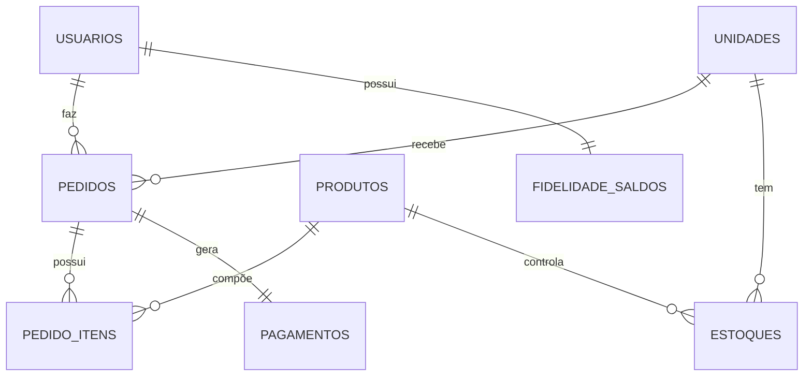
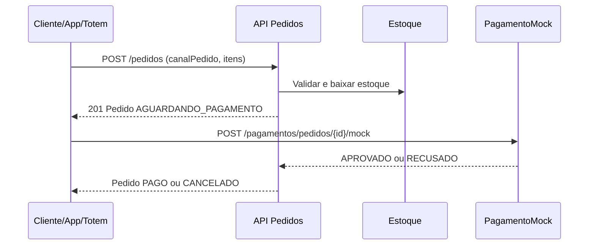

# Modelagem e Arquitetura

## Arquitetura em camadas
- **Domain**: entidades e enums (`Pedido`, `Usuario`, `Estoque`, `Pagamento` etc.)
- **Application**: servicos de caso de uso (`PedidoService`, `PagamentoService`, `AuthService` etc.)
- **Infrastructure**: repositorios, configuracao de seguranca JWT, seed de dados
- **API**: controllers, DTOs e tratamento global de erro

## Entidades principais
- `Usuario` (role, consentimento LGPD, senha hash)
- `Unidade`
- `Produto`
- `Estoque` (por unidade/produto)
- `Pedido` e `PedidoItem` (com `canalPedido`)
- `Pagamento` (mock desacoplado)
- `FidelidadeSaldo`
- `AuditoriaAcao`

## DER simplificado (mermaid)

## Fluxo critico (sequencia simplificada)

